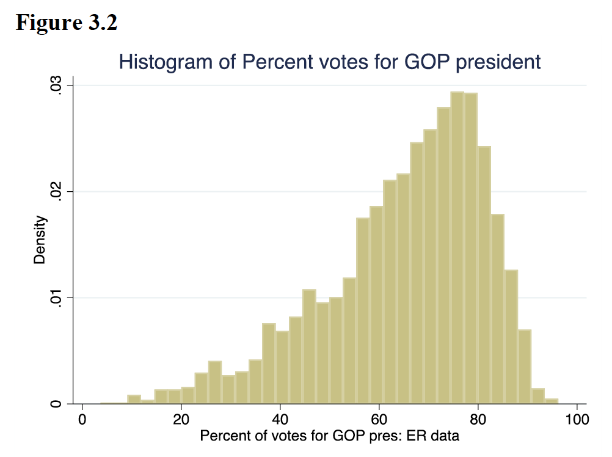

# Partisanship & Covid-19 Death Rates: What can we learn?

## Abstract
In this project, I examine the impact of republican vote share in the US 2020 presidential election and full vaccination percentage on the number of Covid-19 Deaths per 100,000 post Jun 26th, 2021. Economic theory on vaccines as a public good predicts that vaccines will deliver an externality benefit, yielding decreasing returns. Examinations of the current political climate also suggest a bias in vaccine uptake with respect to partisanship. To test the predictions of this theory and public sentiment, I estimate the impact of republican vote share and vaccination rate on the Covid-19 death rate. Increases in republican vote share increase Covid-19 death rates. Increases in vaccination rates decrease Covid-19 death rates. These findings shed new light on the determining factors of individual vaccine decisions, and Covid-19 death prone populations. The project suggests that partisan anti-vaccine sentiment will directly affect their supporting populations negatively.

## Introduction
The Covid-19 pandemic is struggling with misinformation, most notorious are some of the twitter tweets by the 45th President of the U.S, who falsely claims that Covid-19 is less deadly than the seasonal flu. (CNN, n.d.) At a first glance it seems that the lack of vaccine uptake and Covid-19 recognition is prominent in supporters of the GOP. In this report we will take a closer look at the last wave of the pandemic; between June 26th to September 27th, 2021, to investigate the relationship between Republican vote share by county and the rate of covid cases/deaths. We are specifically interested in the relationship between partisanship, the severity of the last wave, and the vaccine rate.

## The Context & Data
The dataset will include observations by country on COVID-19 death rate per 100,000 people, republican vote share in the US 2020 presidential election, full vaccination rate, and etc. A detailed description of the variables used in this report is listed in table 4 below. The cross-sectional dataset will consist of 3000 randomly sampled US counties.

Table 1.1 describes the summary statistics of all the variables used in this analysis. The mean Covid death rate between June 26th to September 27th, 2021, is 35.157 per 100,000 across counties. The death rate has a considerably large range from 0 to 171.254 deaths per 100,000. The standard deviation is 31.396 deaths per 100,000. Considering our summary statistics, we can see that death rate is dispersed over a wider range of values. The mean republican vote share across counties in 64.962%. The vote share has a wide range, between 3.676% and 96.182%. The standard deviation is 16.193%.

Let us now investigate what we can expect from our data. Table 1.2 gives us the mean summary statistics grouped by Republican share. For example, it gives us the average Covid death rate for counties with republican vote share of less than 50%. From the table, we see that the average death rate for vote share greater than 50% is 24.45 per 100,000, compared to the average death rate of 37.50 per 100,000 for vote share less than 50%. We can also see that average vaccination hesitancy is higher in counties with vote share greater than 50% compared to less than 50%. The vaccination rate is also much higher in counties with less than 50% vote share, by 11.703%, this difference is greater than the standard deviation, pointing to potential importance in the relationship between partisanship and vaccination rate. In general, Table 1.2 suggests that in our death rate to republican vote share regression, we can anticipate that republican vote share will be a statistically significant variable.

## Regression Analysis
### Simple Linear Regression
We will be executing a simple linear regression, with the aim to estimate the causal effect of a percentage change in republican vote share on Covid-19 death rates per 100,000 people. The response variable will be the Covid-19 Deaths per 100,000 people post Jun 26th, 2021, per county. The explanatory variable will be the percent of votes for GOP president in the U.S. 2020 election per county. We will test the hypothesis that the effect of Republican vote share on the Covid-19 death rate in the latest wave is zero, with a significance level of 5%. Also, from our summary statistics we observed that counties with over 50% republican vote share had higher mean Covid-19 deaths, thus we expect that a 1 percent increase in republican vote share, will result in a positive increase of Covid-19 death rates.

The SLR model is as follows, 𝑑𝑒𝑎𝑡ℎ 𝑟𝑎𝑡𝑒= 𝛽0+𝛽1(𝑣𝑜𝑡𝑒 𝑠ℎ𝑎𝑟𝑒)+𝑢 for 𝑢=𝑒𝑟𝑟𝑜𝑟 𝑡𝑒𝑟𝑚
Hence, let the null hypothesis 𝐻0:𝛽1=0 and 𝐻𝐴:𝛽1≠0. Using our dataset with 2998 observations, we obtain the following sample regression function. 𝑑𝑒𝑎𝑡ℎ 𝑟𝑎𝑡𝑒̂= 6.993163+0.4331098(𝑣𝑜𝑡𝑒 𝑠ℎ𝑎𝑟𝑒). With standard error of 𝛽1 = 0.0345156, adjusted R-squared value = 0.0496 and p-value of 𝛽1 = 0.000. Since our p-value of 𝛽1<0.05, we reject the null hypothesis. Thus, we conclude that the effect of Republican vote share on the Covid-19 death rate in the latest wave is not zero. Additionally, from the sample regression function, we can interpret that the Covid-19 death rate increases 0.4331098 deaths per 100,000 people, for a 1% percent increase in vote share.

The developed SLR model will only hold if it fulfills all 5 assumptions. (Wooldridge 2020) The 1st assumption is linearity between death rate and vote share. From Figure 3.1 we can see that linearity is not fulfilled, as the relationship looks non-linear. The 2nd assumption: random sampling, is fulfilled since our dataset is a 3000-observation random sampling of counties in the U.S. The 3rd assumption is that the sample vote share values are not all the same. From Figure 3.2 we can see that there is considerable variation, thus this assumption is fulfilled. The 4th assumption is the zero conditional mean, in other words, there must be no omitted variables that is correlated with vote share. We can see that this assumption is far from fulfilled, as we have seen that there is likely a relationship between vaccination rate and vote share from our summary statistics. To fulfil will assumption we must add control variables, which we will do in our multilinear regression section. The 5th assumption is the homoskedasticity of the error term for republican vote share. From Figure 3.1, we can see that this assumption is not fulfilled, seen as vote share increases the variability of Covid-19 death rates increases greatly, thus it shows heteroskedasticity of the error term.

### Multiple Linear Regression
See table 2 for regression results. In the 2nd model, we add the vaccination rate, which increases the adjusted R squared by 0.0981, and changes the vote share coefficient to 0.0583225, taking away its statistical significance. This large change in results implies that there is a relationship between vaccination rate and vote share. This also shows that there was large omitted variable bias in model 1. From the vaccination rate coefficient, we can interpret that, for a 1% increase in vaccination rate, we can expect a 1.247173 decrease in death rates per 100,000 people.

In the 3rd & 4th model, we add the vaccination rate squared. From a theoretical perspective, we expect decreasing returns on the death rate from an increase in vaccination rate, due to herd immunity as more are vaccinated. In both models the coefficient of the vaccination rate is negative, and the coefficient of the vaccination rate squared in positive. This implies that at low vaccination rates, a percent increase of vaccination rate has a negative effect on death rate. This means that vaccination rate as a non-linear effect on death rate, also supported and seen in figure 3.3. In model 3, we find that the coefficient of the vaccination rate squared term is 0.0078913. significant to the 5% level. The adjusted r-squared also increases from model 2 to model 3, implying less omitted variable bias.

In our 4th model, we add many controls to model 3 such as health conditions and racial makeup, for more details see table 2. From model 3 to 4, the adjusted r-squared has increased from 0.1490 to 0.3627. In our SLR model we concluded that we were not able to satisfy the zero conditional means assumptions. Adding more controls like in model 4 removes a some of the omitted variable bias. One of the assumptions of MLR is no perfect collinearity, to prevent this in our model we have omitted percentage of native Hawaiians, SVI: Very high vulnerability, and large fringe metro from our model. Given the number of control variables, and high adjusted r-squared value model 4 is the most reliable. From the model we can see that vote share is statistically significant; 1% percent increase in vote share has expected increase of 0.454 deaths per 100,000, vaccination rate is statistically significant; 1% percent increase in vaccination rate has expected decrease of 0.674 deaths per 100,000. It is also noteworthy that heart disease, diabetes, hesitancy (definitely not), hesitancy (probably not) was all statistically significant in the positive direction, implying that from an increase in 5 these variables we can expect an increase in death rate. Also, counties considered very low vulnerability on the SVI index are expected to have death rates lower by 14.75054 deaths per 100,000 compared to every other county. This effect can also be seen in SCI low vulnerability to a lesser degree. Counties considered noncore also can expect -8.709 death rates than other counties, this is probably due to less density leading to less spread. The only strange statistically significant outcome was the obesity variable, where a 1% increase in obesity prevalence can expect a 1.54 decrease in the death rate. This goes against the consensus that obesity is detrimental when surviving Covid-19 and does not seem to have a practical significance despite a statistically significant result.

## Limitations of Results
The most reliable model out of our analysis is model 4. Model 4 considers many control variables to reduce omitted variable bias. However, there are still omitted variables that remain in the residual of our model. For example, we have not controlled for age in the county, which we know is a very important factor in the death rates of Covid-19. Using age as our example, the omitted variable age may have a relationship with the health condition variables in our model. This means that we have an omitted variable that is correlated with some of the independent variables, breaking our zero conditional mean assumption. To mitigate this, we will have to keep adding more control variables to our model. In our final model we have not properly investigated the linearity assumption, as we will need to investigate whether linearity holds among our parameters. Another important remaining threat to the validity of the regression results, is the very strange obesity results from model 4. The results are the exact opposite of what we expect them to be, and this must be resolved and understood for our regression to be credible. We suggest adding more control variables that may be correlated to obesity to examine this.

## Conclusion
While our models still have many limitations that it must overcome, we draw from our statistical significance tests and conclude that out hypothesis was indeed correct. More specifically, a 1% increase in republican vote share can expect to increase Covid-19 death by 0.45 deaths per 100,000. And a 1% increase in vaccination rates can expect to decrease Covid-19 death by 0.675 deaths per 100,000. Perhaps these results should be reflected on by the GOP, and perhaps be a wakeup call to increase Covid-19 vaccine support in their campaigns.

## References
1. CNN, Donie O’Sullivan. n.d. “Facebook Removes Trump Post Falsely Saying Flu Is More Lethal than Covid.” CNN. https://www.cnn.com/2020/10/06/tech/facebook-trump-covid-flu-false/index.html.
2. Wooldridge, Jeffrey M. 2020. Introductory Econometrics: A Modern Approach. Singapore: Cengage Learning Asia Pte Ltd.

## Appendix

Thank you for reading!

